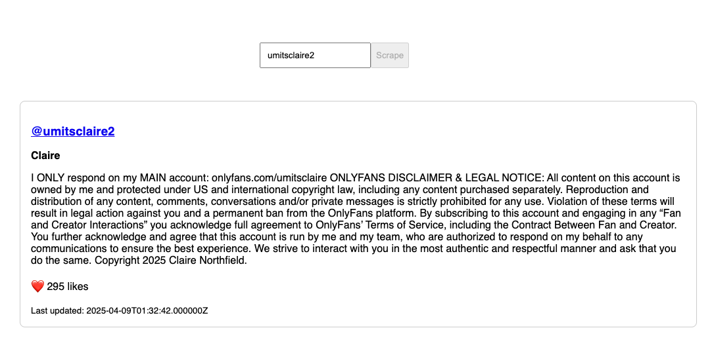

# Onlyfans Scraper

## 🛠️ Setup Instructions

1. **Clone the repo and install dependencies**

```bash
git clone https://github.com/murilorr90/onlyfans-scrapper.git
cd onlyfans-scrapper
composer install
cp .env.example .env
php artisan key:generate
```

2. **Configure `.env`**

- Set up your database (MySQL, PostgreSQL, etc.)
- Configure Laravel Scout driver (e.g., Meilisearch or Algolia)

3. **Run migrations**

```bash
php artisan migrate
```

4. **Install and run Horizon**

```bash
php artisan horizon
```

5. **Install Chrome driver from dusk**
```bash
php artisan dusk:install
php artisan dusk:chrome-driver --detect
```
6. **Run Scout indexing**

```bash
php artisan scout:import App\\Models\\Profile
```

7. **Serve the app**

```bash
php artisan serve
```

Now you can visit `http://127.0.0.1:8000` and test the interface.

## 🧠 How It Works

- The **search bar** uses AJAX to query `/api/search?q=...` that search using Laravel Scout in Database.
- If the user is not found, a **"Scrape"** button becomes enable.
- When clicked, it sends a `GET` request to `/api/scrape`, trigger and dispatches a job to scrape data.
- **Scheduled Jobs** are defined in `routes/console.php` and dispatch scraping jobs to the queue using Horizon (which provides UI interface to track these jobs).
- Also, I create two commands that you can call anytime:
  - `php artisan scrape:random`: to get 100 users randomly from Onlyfans.
  - `php artisan scrape:user {username}`: to get a specific user data.

## ✅ Requirements

- PHP 8.1+
- Laravel 12+
- Redis
- Meilisearch or Algolia (for Laravel Scout)
- Horizon enabled

## 📷 Example

